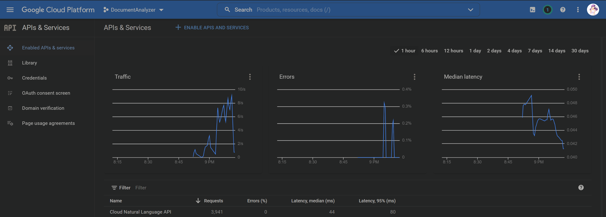

## Document Analyzer

The document analyzer is created for analyzing text documents based on various characteristics of each of the document. 
It can be used for text extraction, plagiarism checking and sentiment analysis using third-party APIs.

### Part I: Text analysis 
A ```document``` class is created for storing the text and helping perform certain operations and analyses. 
In this task, I performed the following operations after retrieving the text from a URL or a local file path:
- Split the document into its consistent sentences[^1] to determine:
    - The average number of words[^2] in a sentence, m<sub>1</sub>
    - The average number of phrases[^3] per sentence, m<sub>2</sub>
- Break the document down further into phrases and words to compute:
  - The average word length, m<sub>3</sub>
  - The number of unique words to the total number of words, m<sub>4</sub>
  - The number of words occurring exactly once to the total number of words, m<sub>5</sub>


### Part II: Sentiment Analysis
In this part, Google Cloud Natural Language client library is used to detect the sentiment[^4] of each sentence 
in the given document. Using Google's Natural Language AI system, we can obtain a sentiment score and a sentiment magnitude. 
A sentence is positive if the sentiment score is ≥ 0.3. A sentence is negative is the sentiment score is ≤ -0.3.

<p align="center"></p>  

### Part III: Document Similarity Analysis

&space;=&space;\frac{1}{2}\sum_{i&space;=&space;1}^{n}(p_ilog_2&space;\frac{p_i}{m_i}&space;&plus;1_ilog_2&space;\frac{1_i}{m_i}&space;))


[^1]: We will consider a sentence to be a sequence of characters that is terminated by  the characters ```! ? .``` or 
EOF excludes whitespace on either end and is not empty.

[^2]: A word is a non-empty token that is not completely made up of punctuation. 
If a token begins or ends with punctuation then a word can be obtained by removing the starting and trailing punctuation.
Specifically, the start of word should not contain any of ``` ``! " $ % & ' ( ) * + , - . / : ; < = > ? @ [ \ ] ^ _ ` { | }.```
The end of a word should not include any of ``` ``! # " $ % & ' ( ) * + , - . / : ; < = > ? @ [ \ ] ^ _ ` { | } ~.``` 
Hyphenated words are considered to be one word. Words are allowed to start with hashtags `#`.

[^3]: A phrase is a non-empty (empty = empty string or whitespace only) part of a sentence that 
is separated from another phrase by commas, colons and semi-colons.

[^4]:It is important to note that the Natural Language API indicates differences between positive and negative emotion in a document,
but does not identify specific positive and negative emotions. 
For example, "angry" and "sad" are both considered negative emotions. 
However, when the Natural Language API analyzes text that is considered "angry", or text that is considered "sad", 
the response only indicates that the sentiment in the text is negative, not "sad" or "angry".